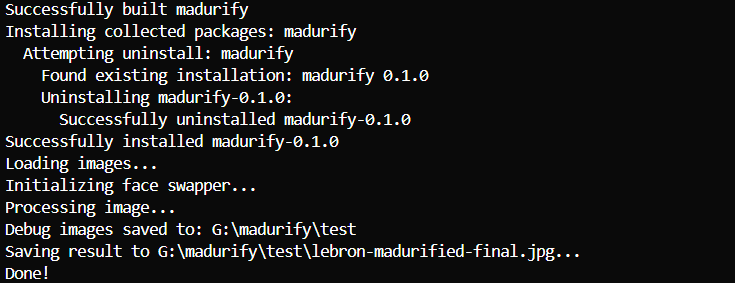
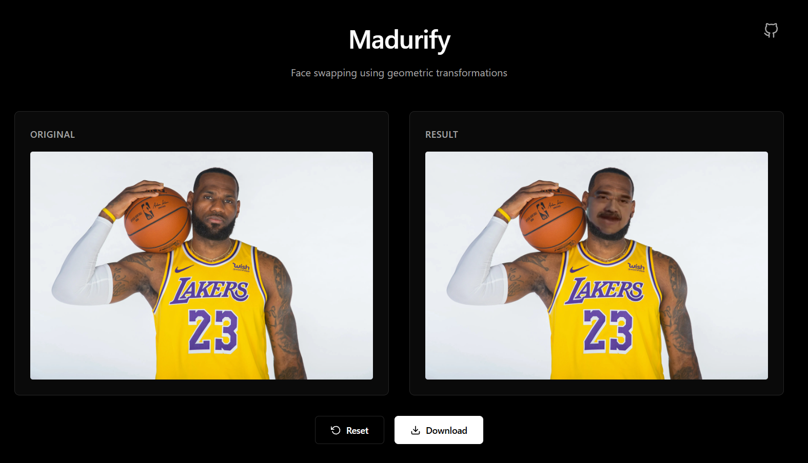

# Madurify

A Python application with CLI and web interfaces that lets you swap faces in images without using AI!

## Features

- Face detection using dlib
- Face swapping directly from the python application
- Web interface with drag-and-drop upload

## Requirements

- Python 3.11+

## Installation

1. Clone the repository:
```bash
git clone https://github.com/iakzs/madurify.git
cd madurify
```

2. Install dependencies, setup the application:

Quick install & setup (if CMake is installed):
```bash
pip install -r requirements.txt && pip install -e .
```



## Usage

### CLI

Process a single image:
```bash
madurify input.jpg -o output.jpg
```

Or use Python directly:
```bash
python -m src.cli.main input.jpg -o output.jpg
```

Options:
- `-o, --output`: Output file path (default: `input_madurified.jpg`)
- `-m, --maduro-face`: Path to face templates (can be more than one) (default: `assets/maduro_face*.jpg`)
- `-p, --predictor`: Path to dlib predictor (default: `models/shape_predictor_68_face_landmarks.dat`)

### Web Interface

Start the web server:
```bash
uvicorn src.web.app:app --reload
```

Then open your browser to `http://localhost:8000`



## Warning

The developer and contributors do not contribute to this application for hate purposes. This repository is intended for educational purposes only.

## License

See LICENSE file for details.
